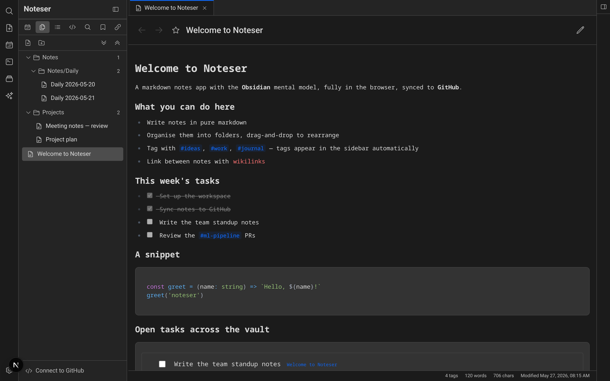

# Noteser


**Live:** [noteser.app](https://noteser.app)

<!-- TODO: drop a hero screenshot or GIF here.
     Suggested path: `public/screenshot.png` (or `.gif`), then:
      -->

Browser-first, Obsidian-style markdown note app with optional GitHub sync.

- **Local-first.** Notes live in `localStorage`; no account required to start.
- **Workspace tabs.** Multiple notes open at once, drag-and-drop tabs, split the editor horizontally.
- **Obsidian-ish.** Wikilinks (`[[note]]`), inline `#tags`, daily notes calendar, live-preview markdown, task-list shortcuts.
- **GitHub as your vault.** Pick a repo, click *Sync*, your notes land as clean `.md` files. Pulls remote changes back. Per-line merge conflict resolver when both sides change.

## Quick start

```bash
npm install
npm run dev          # http://localhost:3001
```

Other useful commands:

| Command | What it does |
| --- | --- |
| `npm run build` | Production build |
| `npm run lint` | ESLint via Next.js |
| `npm run typecheck` | `tsc --noEmit` |
| `npm test` | Jest |

## Environment variables

Create a `.env.local` in the project root:

```ini
# Required for GitHub sync to work. Get this from
# https://github.com/settings/developers
NEXT_PUBLIC_GITHUB_CLIENT_ID=Ov23li...

# Optional. If set, the editor connects to your y-websocket server for
# real-time collaboration. Leave unset to use local-only persistence (the
# default — the previous public demo server was removed for security).
NEXT_PUBLIC_YJS_WS_URL=wss://your-server.example.com
```

`.env.local` is gitignored. For your hosting platform, add the same keys to the project's environment-variable settings.

## Setting up GitHub sync

1. https://github.com/settings/developers → **New OAuth App**
   - Application name: anything (e.g. `Noteser local`)
   - Homepage URL: `http://localhost:3001` for dev, or your deployed URL for prod
   - Authorization callback URL: same as Homepage URL (device flow ignores it but the field is required)
2. After creating, edit the app and tick **Enable Device Flow**.
3. Copy the **Client ID** into `.env.local` as `NEXT_PUBLIC_GITHUB_CLIENT_ID`. No client secret needed.
4. Restart the dev server so it reads the new env var.
5. In the running app, click **Connect to GitHub** in the sidebar footer → enter the 6-character code on github.com → pick or create a vault repo.

## Deploying

Production runs at **[noteser.app](https://noteser.app)**.
The app is a standard Next.js project — any platform that supports Next.js
server routes will work (Vercel, Netlify, Cloudflare Pages with the
adapter, your own VPS). The two `/api/github/*` routes are required (they
proxy the OAuth device-flow endpoints which don't support CORS), so a
pure-static export won't work.

### Branch model

| Branch | Auto-deploys to | Purpose |
|---|---|---|
| `main` | noteser.app | Production. Only PR-merge from `dev` or hotfixes |
| `dev` | `noteser-git-dev-*.vercel.app` (auto) | Integration / preview |
| `feat/*` · `fix/*` | per-branch preview URLs | Feature work |
| `hotfix/*` | per-branch preview URL | Prod emergencies, PR straight to `main` |

CI (`.github/workflows/ci.yml`) runs lint + typecheck + tests + build on
every push and PR — read the badge before merging. Full workflow is in
[`docs/release-process.md`](docs/release-process.md).

For a custom domain:
1. Point a `CNAME` (or `A`) record to your hosting platform.
2. Set `NEXT_PUBLIC_GITHUB_CLIENT_ID` (and optionally `NEXT_PUBLIC_YJS_WS_URL`) in the platform's environment variables.
3. In the GitHub OAuth App settings, change Homepage / Authorization callback URL to your production domain.

## Architecture (10 000 ft)

- **Next.js 15 / React 19**, single-page layout in `src/app/page.tsx`.
- **State**: five Zustand stores in `src/stores/` (`note`, `folder`, `tag` legacy, `ui`, `github`, `workspace`). All persisted to `localStorage` under `noteser-*` keys.
- **Workspace = panes**. Two horizontal panes max; each pane has its own tabs[]. Merge-conflict resolution opens as a tab (not a modal).
- **Editor**: CodeMirror 6 (`@uiw/react-codemirror`) with a custom live-preview StateField that styles markdown inline (headings, bold, lists, blockquotes, tags).
- **GitHub sync**: device-flow OAuth (proxied through two thin Next.js API routes because GitHub's OAuth endpoints lack CORS), then direct calls to `api.github.com` from the browser. Single-commit-per-sync via the Git Data API; three-way merge using a local `gitLastPushedSha` per note.
- See [`CLAUDE.md`](./CLAUDE.md) for deeper detail.

## Security notes

- The GitHub access token lives in `localStorage`. An XSS would expose it. Same trust model the Obsidian Git plugin uses. Acceptable for a personal vault, NOT for a hosted multi-user app.
- The two `/api/github/*` proxy routes are unauthenticated. Per-IP rate limiting is in place but if you self-host on public infrastructure, consider tightening further.
- Real-time collaboration (`useCollaboration`) is opt-in via `NEXT_PUBLIC_YJS_WS_URL`. The previous default was the public `wss://demos.yjs.dev` — removed because anyone with a note id could read/write.

## Keyboard shortcuts

| Shortcut | Action |
|---|---|
| `Ctrl + K` | Open search |
| `Ctrl + /` | Show all shortcuts |
| `Ctrl + E` | Toggle preview mode |
| `Ctrl + B` | Toggle sidebar |
| `Ctrl + Delete` | Delete current note |
| `Ctrl + Shift + 7` | Insert numbered list (editor) |
| `Ctrl + Shift + T` | Insert todo item (editor) |
| `Alt + L` | Editor: convert line to/from task. Preview: check/uncheck task at cursor |
| `Alt + Shift + L` | Editor: check/uncheck task at cursor (stamps ✅ date). Preview: strip `- [ ]` prefix |
| `Escape` | Close modal / search |

Right-click any note or folder for rename / move / delete / new-subfolder.

## Roadmap

See [`docs/roadmap.md`](./docs/roadmap.md) for the full backlog (Now / Next / Later).
