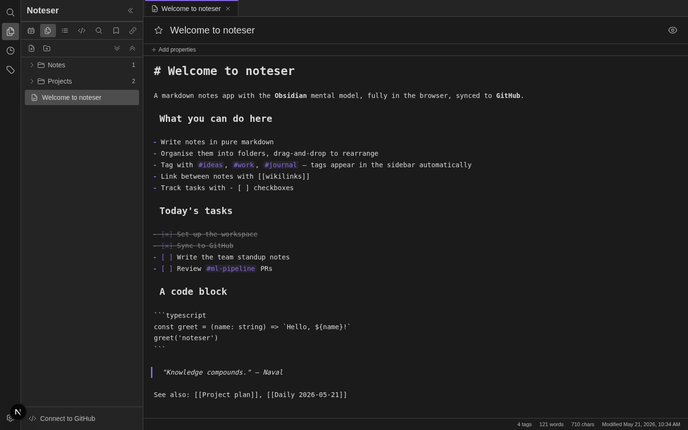
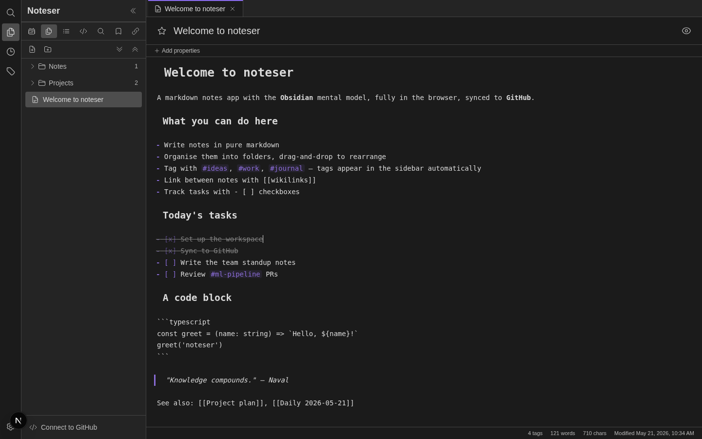
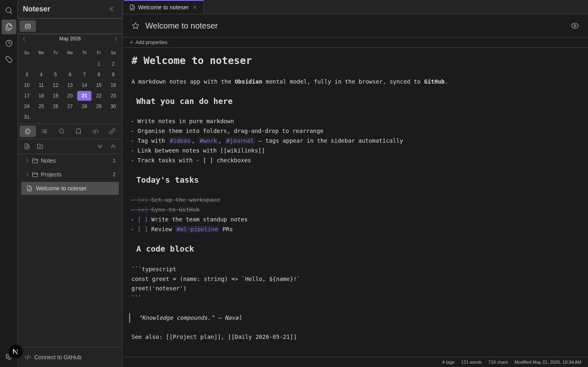
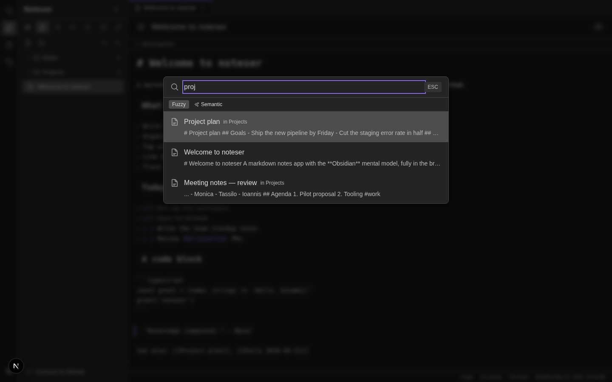
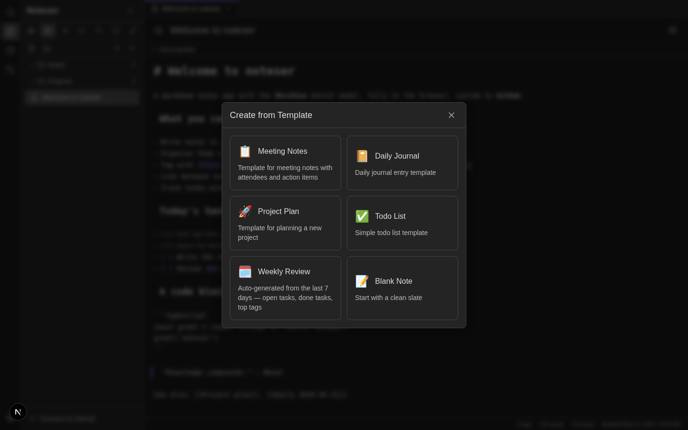
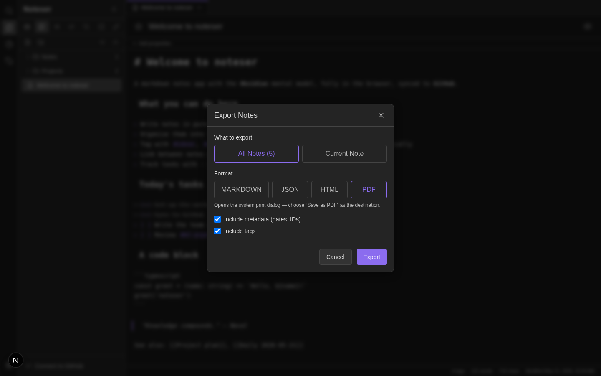
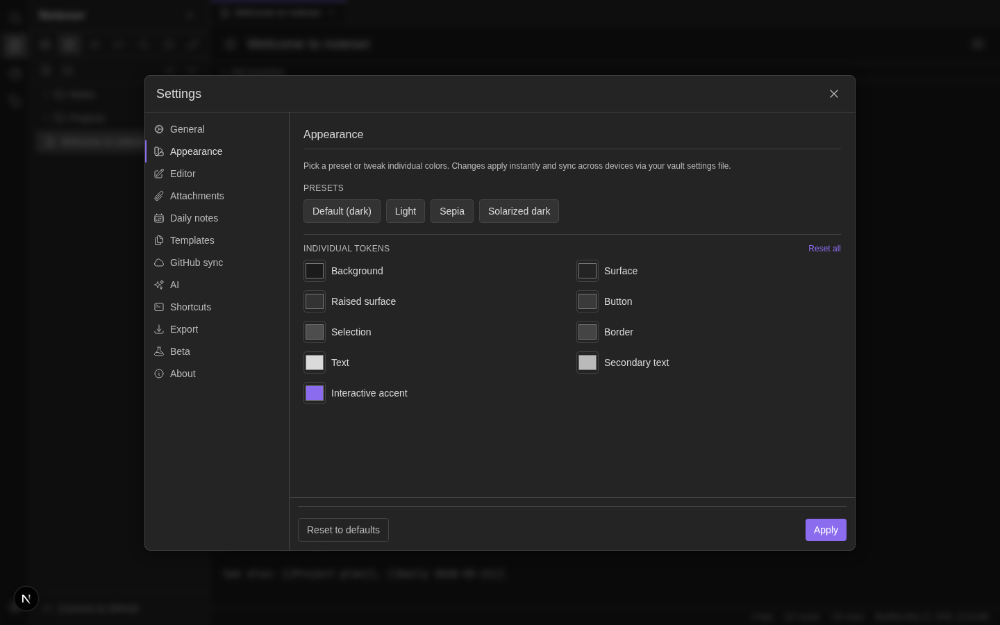
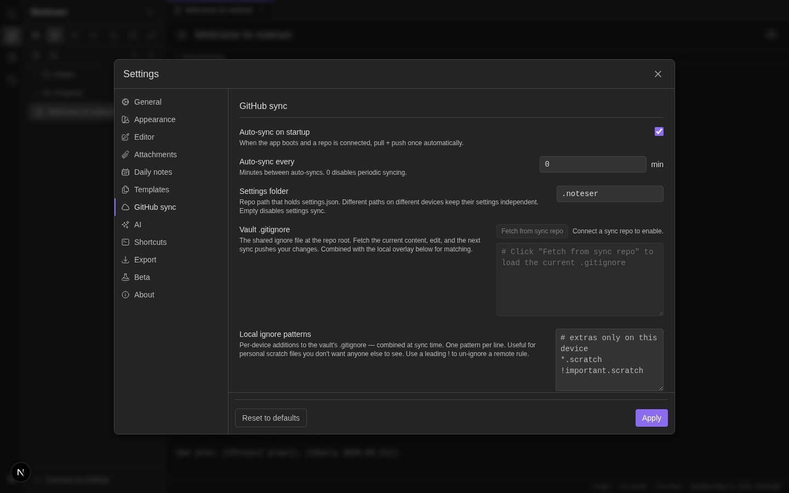

# noteser — what one engineer built in a weekend with Claude Code

> **Browser-based Obsidian, with GitHub sync and task management.**
> Built end-to-end by one person in **under 40 hours**, evenings and weekends,
> with **zero hand-written lines of code** — every feature shaped through
> natural-language conversation with Claude Code.

Live at **[noteser.thetechjon.com](https://noteser.thetechjon.com)** ·
source on **[GitHub](https://github.com/ipapakonstantinou/noteser)**.

---

## The idea

I wanted Obsidian's editing experience, but in the browser, with my notes
versioned in a GitHub repo I already own. The same mental model — markdown
files in folders, wikilinks between them, tags emerging from `#word`
patterns, tasks tracked with `- [ ]` checkboxes — but accessible from any
device, with the durability and history that git gives you for free.

What's below is what that turned into.

---

## The editor

A real markdown editor (CodeMirror 6) with **live preview** in the
Obsidian sense — headings, tags, code fences, and wikilinks render
inline as you type. The currently-edited line shows the raw markdown
so you can see the structure; every other line is rendered.

Tasks (`- [ ]` / `- [x]`) toggle with a keyboard shortcut. Tags appear
in the sidebar automatically. Wikilinks (`[[Note name]]`) become
clickable jumps between notes.

---

## The workspace

The sidebar uses Obsidian's stacked pane model:

- A row of **draggable panel icons** (Files, Search, Outline, Tags,
  Bookmarks, Related notes, Source Control, Calendar)
- **Pin** any panel to its own mini-strip at the top — drag-up,
  right-click, or keyboard
- **Multi-panel groups** — drop a panel onto another's strip to share
  a slot
- The pinned area **scrolls independently** so you can stack many
  groups without losing access to the main strip

Tabs work the way they do in Obsidian + VS Code: single-click opens a
preview tab; double-click pins; drag a tab to the right edge to split
the workspace into two horizontal panes.

---

## Quick switcher (Ctrl+K)

Fuse.js-powered fuzzy search across titles, content, and tags, with a
**semantic search** mode toggle that uses embeddings to find
conceptually-related notes (not just lexically-matching ones). The
embedding index re-builds itself when notes change.

---

## Templates — including auto-generated weekly review

Six built-in templates. The Weekly Review one is special: it scans
the past 7 days of notes and **auto-aggregates open tasks, completed
tasks, and the most-used tags into a draft review note**. The other
templates are standard skeletons.

Daily / weekly / monthly notes plug into the calendar panel — clicking
a date opens (or creates) that day's note in the configured folder.

---

## Export — including PDF

Notes export as Markdown, JSON, or HTML (single note or full vault
zip). The **PDF option** opens the system print dialog so the user
can pick "Save as PDF" — no extra dependencies, prints cleanly with
page breaks between notes.

---

## Theming

Pick from preset themes (Default dark, Light, Sepia, Solarized dark) or
adjust individual color tokens with the picker grid. Changes apply
**live via CSS variables on `:root`** — no reload, and overrides sync
across devices via the vault settings file.

---

## GitHub sync

GitHub is the source of truth. One repo per vault, notes stored as
plain `.md` at the repo root, full pull-then-push pipeline:

- **Three-way merge** using the last-pushed SHA — most edits sync
  automatically without conflicts
- **Conflicts open as tabs** with a VS Code-style inline merge editor
  (line diffs, take-local / take-remote / keep-both)
- **Vault settings** travel with the repo — change a setting on one
  device, see it on the next
- **`.gitignore`** is respected both ways, with an in-app editor for
  the shared file plus a per-device overlay
- **OAuth device-flow** authentication; token stays in the browser

Plus a **VS Code-style Source Control panel** with commit messages
(optionally drafted by AI), per-file change badges, and an editor
gutter diff showing added / modified lines since the last push.

---

## AI features

Built on top of the user's own Anthropic or OpenAI API key — nothing
is centralised:

- **Per-note actions** — Summarize, Extract tasks, Suggest tags,
  Rewrite for clarity, Translate
- **Embeddings + Related notes panel** — semantic neighbours appear
  in the sidebar automatically as you write
- **Semantic search** in the Ctrl+K quick switcher
- **AI commit messages** — drafts a meaningful summary from the
  pending diff

---

## Sharing

A `/share` page that takes a note encoded into the URL fragment
(no backend). v2 of this adds:

- **Expiry timestamp** baked into the payload
- **Burn-after-read** flag (recipient-side flip on first decode)
- Default expiry / burn-on-share toggles in Settings

---

## Productivity flourishes

- **Daily-note streak counter** — a 🔥 chip in the footer when there
  are consecutive daily notes
- **Trash folder** — synthetic `.trash` row at the top of the tree;
  deleted notes look like normal rows, restore from context menu
- **Drag-and-drop everywhere** — notes into folders, folders into
  folders, tabs between panes, panels between strips
- **Keyboard-first** — Ctrl+K search, Alt+N new note, Alt+Shift+L
  toggle task, customisable shortcut overrides

---

## Quality

This isn't a prototype:

- **TypeScript strict mode** end to end
- **76 Jest test suites**, **1,130+ passing tests** — every feature
  has unit coverage
- **Playwright e2e** layer for browser flows
- **Security pass** — CSP headers, OAuth proxy origin allowlist, XSS
  lock-in tests, per-IP rate limiting
- **Custom QA agent** that drives Playwright through Obsidian-parity
  scenarios so changes get tested without manual clicks

---

## The "how"

Every commit in this repo came from a conversation with **Claude Code**
— I described the feature I wanted in plain English, Claude proposed
an implementation, I responded with feedback, Claude iterated. I never
opened a code file to type code by hand. Refactors, security passes,
test additions, bug fixes — all of it.

Total active time, by my reckoning: under 40 hours, spread across
weekends and weekday evenings. The hardest part wasn't writing the
code — it was knowing what to ask for next.

If you're curious how this actually looks in practice, I'm happy to
demo a live 30-minute "vibe coding" session.
